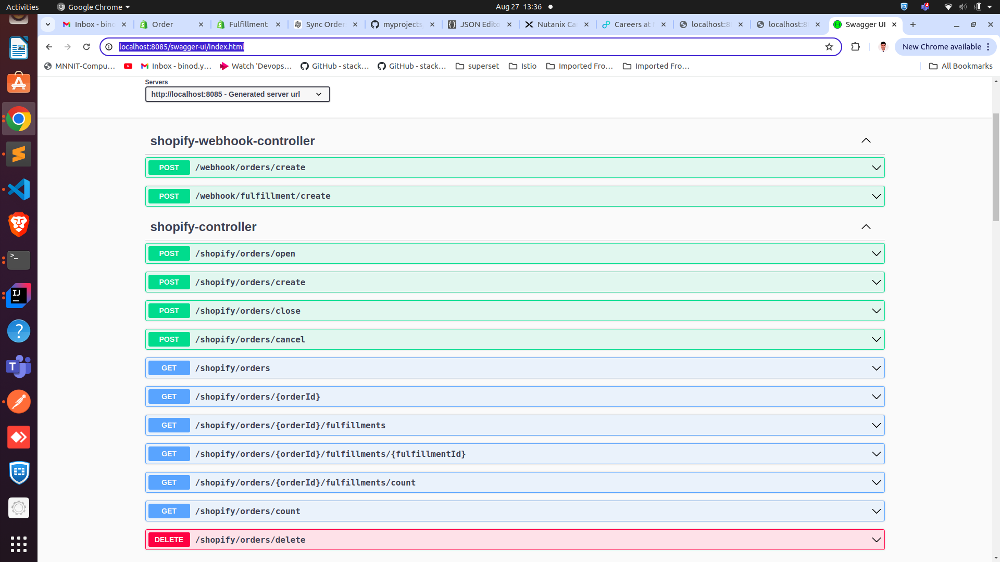
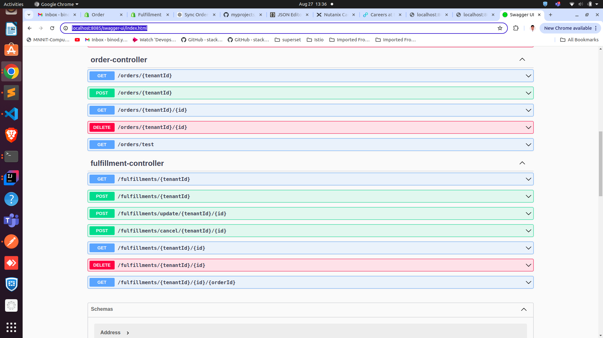

# Shopify POC

This project is a proof of concept (POC) to demonstrate the integration of a Shopify store with a Spring Boot application. The project covers the creation of webhooks, handling orders and fulfillments, and syncing data with Elasticsearch.


## Prerequisites

Before you begin, ensure you have the following installed:

- **Java 17** or later
- **Maven** (for building the project)
- **Spring Boot** (used in the application)
- **Elasticsearch 8.14.2**
- **ngrok** (for exposing your local server to the web)
- **Git** (for version control)

## Elastic Search Installation
- **Used Docker for ELastic search** 


   ```bash
   
   docker pull docker.elastic.co/elasticsearch/elasticsearch:8.14.2
   
   docker run -d --name elasticsearch \
  -p 9200:9200 \
  -e "discovery.type=single-node" \
  -e "xpack.security.enabled=false" \
  -e "ES_JAVA_OPTS=-Xms2g -Xmx2g" \
  docker.elastic.co/elasticsearch/elasticsearch:8.14.2

```

## ngrok setup

**To sync order and fulfillment data**
- **whenever order is created in shopify we will receieve that particular order data via webhook exposed to creating the order**

- **Processing of configuring ngrok**
   ```bash
    sudo snap install ngrok
    ngrok config add-authtoken YOUR_AUTHTOKEN
    ngrok http 8085(springboot exposed port)
  ```

## Webhook Url Creation For Order data
- **Webhook url creation for creating order**
- **adress in payload is ngrok base url of spring app and endpoint is the controller where we want to recieve the order data**

   ```bash
   curl --location 'https://<shopify.base.url>.myshopify.com/admin/api/2023-07/webhooks.json' \
   --header 'Content-Type: application/json' \
   --header 'X-Shopify-Access-Token: <shopify.token>' \
   --data '{
     "webhook": {
       "topic": "orders/create",
       "address": "<ngrok.base.url>/webhook/orders/create",
       "format": "json"
     }
   }'

  ```

## Webhook Url Creation For FulFillment data
- **Webhook url creation for creating fulfillment**
- **adress in payload is ngrok base url of spring app and endpoint is the controller where we want to recieve the fulfillment data**

   ```bash
   curl --location 'https://<shopify.base.url>.myshopify.com/admin/api/2023-07/webhooks.json' \
   --header 'Content-Type: application/json' \
   --header 'X-Shopify-Access-Token: <shopify.token>' \
   --data '{
   "webhook": {
   "topic": "fulfillments/create",
   "address": "<ngrok.base.url>/webhook/fulfillment/create",
   "format": "json"
   }
   }'

  ```

- **Once the webhook urls is created create product in shopify website and then create the order after order is created we will get order details in shopify springboot app via shopify webhook controller**
- **Once we reciebe order details in shopify spring app we will store in elastic search**
- **We can fullfill the order we will recieve the fullfillment in different controller exposed in shopify spring app**
- **We can store that fulfillment data in elastic search**
<br>
<br>
- **I have exposed different api's to be ingested by UI team for doing crud on that order data as well for fulfillment data**
- **Also exposed different api's for order and fulfillment globally for shopify website**


## Url for api docs
http://localhost:8085/v3/api-docs

## Url for swagger
http://localhost:8085/swagger-ui/index.html





## Created Dockerfile for creating image of shopify
Open [`Dockerfile`](./Dockerfile) (for Dockerfile)  you can create the image using the docker file
```bash
mvn clean install 
docker build -t shopify .
docker tag shopify <dockerhubUsername>/<repo>:<tag>
docker push <dockerhubUsername>/<repo>:<tag>

```
## Created Deployment and service file for elasticsearch8.14.2
Open [`elastic-deployment.yaml`](./elastic-deployment.yaml)  you can create the elastic search pod running using kubernetes
```bash
kubectl apply -f elastic-deployment.yaml

```
## Craeted Deployment and service file for shopify springboot service

Open [`shopify-deployment.yaml`](./shopify-deployment.yaml)  you can create the shopify sprinboot app pod running using kubernetes
Replace image name in line no 19 with your created image
```bash
kubectl apply -f shopify-deployment.yaml

```
## API Documentation

To view the API documentation, follow these steps:

1. Clone the repository to your local machine.
2. Open [`swagger-ui.html`](./swagger-ui.html) (for Swagger UI)  in your web browser to view the API documentation.

The documentation includes all the controllers, endpoints, and models defined in the OpenAPI specification.
